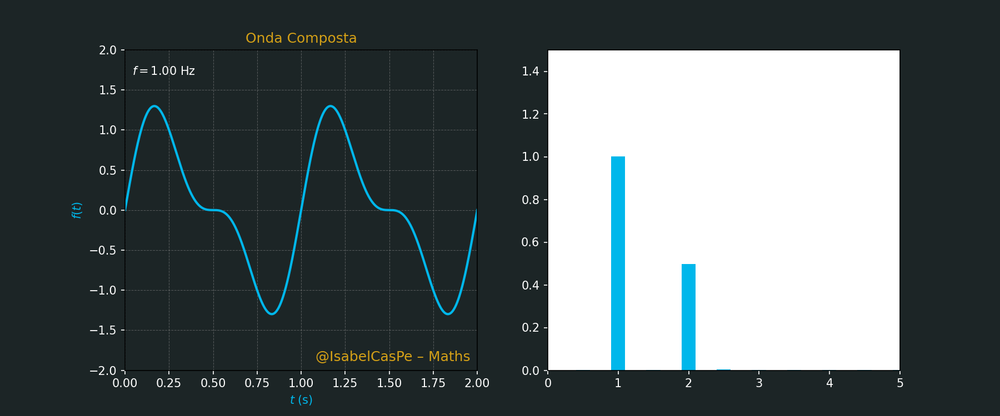
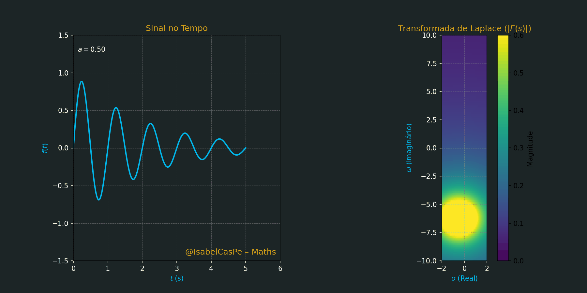

<!-- HERO -->
# Arte & Ciência em Movimento - Matemática Viva 💎🧮✨ 

  

**PT · EN · ES** · [Galeria](#galeria--gifs) · [Instalação](#instalação--installation--instalación) · [Licença MIT](#licença--license--licencia)

---
## Fourier and PDE Solutions: Applications in Heat, Wave, and Laplace Equations  

🌟 **Bem-vindo ao Repositório de Soluções de EDPs e Fourier** 🌟  
Criado pela **Prof. Ana Isabel Castillo**, este repositório oferece uma coleção de **materiais didáticos** para alunos, com foco em **Matemática**, **Física** e suas aplicações em **Finanças** e **Engenharia**. Inclui **notebooks Jupyter** e **resoluções em PDF**, com exercícios práticos, revisões temáticas e desafios que estimulam o raciocínio lógico, a autonomia e a excelência acadêmica.

Este repositório explora a aplicação de métodos de análise de Fourier a Equações Diferenciais Parciais (EDPs) clássicas, como a Equação do Calor, Equação da Onda e Equação de Laplace. As soluções incluem tanto deduções analíticas quanto simulações numéricas, usando séries e transformadas de Fourier para resolver problemas de valor inicial e de contorno.
---
## EDP - Visualizações

## Fourier - Contínua | Discreta (FFT) | Quântica (QFT)

---

---

### 🌊 Análise de Fourier
*Decomposição em modos senoidais para resolver EDPs lineares por separação de variáveis (séries/transformadas de Fourier).*

### 🧩 Equação de Laplace \(\nabla^{2}u=0\)
*Soluções harmônicas determinadas por condições de contorno; suavização e princípio do máximo.*

---

## 📚 Contents
- [Heat_Equation_Problems](Heat_Equation_Problems.pdf)
- [Wave_Equation_Problems](Wave_Equation_Problems.pdf)
- [Laplace_Equation_Problems](Laplace_Equation_Problems.pdf)
- [Boundary_Value_Problems](Boundary_Value_Problems.pdf)
- [Fourier_Transform_Applications](Fourier_Transform_Applications.pdf)

---

## 📐 How to Use
- Todos os exercícios estão em formato **LaTeX**.
- Simulações e gráficos são gerados usando **Python**.
- [ExemplosEDPs.ipynb](ExemplosEDPs.ipynb)

---

## 📚 References
- Evans, L. C. (2010). *Partial Differential Equations*.
- Strauss, W. A. (2007). *Partial Differential Equations: An Introduction*.
- Guidorizzi, H. L. (Volume 6, Fourier and PDE Applications).

---

##  Agradecimento
Este repositório é dedicado aos meus alunos, cuja curiosidade e dedicação inspiram meu trabalho. Agradeço à comunidade acadêmica por apoiar a disseminação do conhecimento e conectar mentes brilhantes.

---

## 📬 Contato
- **Autora:** Prof. Ana Isabel Castillo  
- **Email:** [anacp20@gmail.com](mailto:anacp20@gmail.com)  
- **GitHub:** [@IsabelCasPe](https://github.com/IsabelCasPe)  
- **Site:** [isabelcaspe.github.io](https://isabelcaspe.github.io/)  
- **Repositório:** [Fourier-EDP-Solutions](https://github.com/IsabelCasPe/Fourier-EDP-Solutions)  

🌟 **Gostou? Deixe uma estrela no repositório e continue aprendendo com paixão!** 🌟

---

## 🌐 Outros Links
- [Website SuperProf Isabel](https://www.superprof.com.br/doutoranda-matematica-aplicada-ime-usp-mestre-ciencias-pela-pme-escola-politecnica-usp-ofereco-reforco-universitario.html)
---
   MIT License © 2025 Ana Isabel Castillo
---

## Inspiration.
> "Nas ondas de Fourier, as EDPs revelam a estrutura do universo @FourierEDPSolutions onde o espectro transforma o caos em harmonia matemática." 🌊 ∫ 📊 🎼
> Copyright © 2025 Prof. Ana Isabel C.

---
   
   

